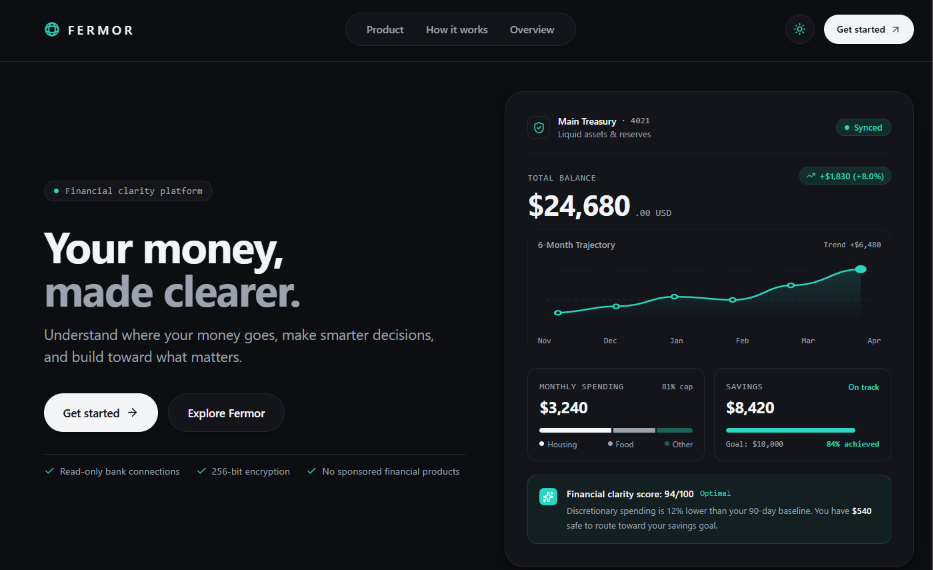
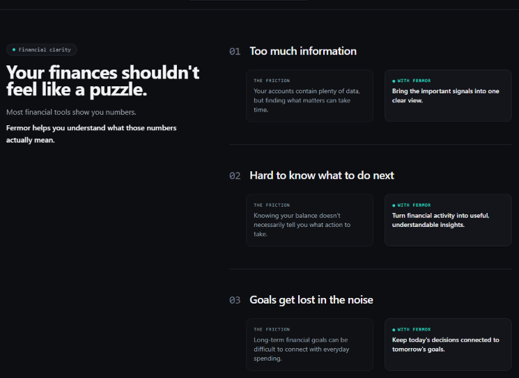
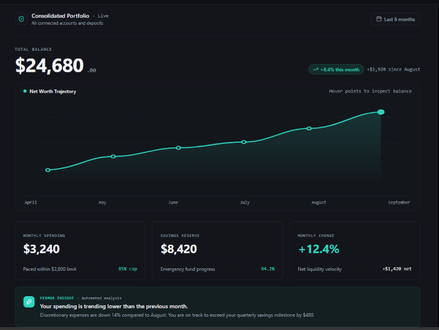
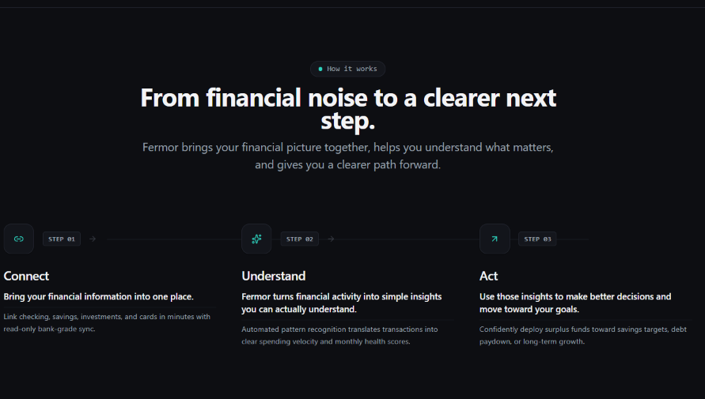
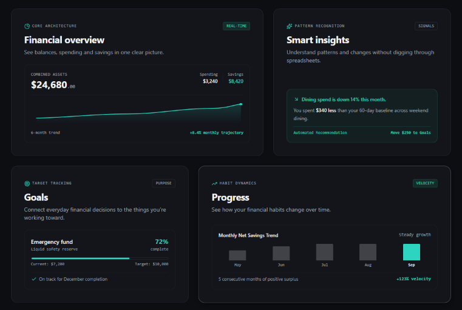

# Fermor — Your Money, Made Clearer

[](https://nextjs.org/)
[](https://www.typescriptlang.org/)
[](https://tailwindcss.com/)
[](https://www.framer.com/motion/)
[](https://fermor-kohl.vercel.app/)

**Fermor** is a modern financial platform engineered to deliver **financial clarity, not simply banking**. The interface prioritizes calm, intelligent, trustworthy, and simple design patterns—helping people understand where their money goes, make smarter decisions, and build toward what matters.

Built from first principles as an editorial, high-craft web application rather than an AI-generated template.

---

## ✦ Platform Preview


*Live Production Application:* **[https://fermor-kohl.vercel.app/](https://fermor-kohl.vercel.app/)**

<details>
<summary><b>📸 Click to view individual section previews</b></summary>
<br />

| Section | Preview |
| :--- | :--- |
| **Hero & Financial Preview** |  |
| **Problem vs Solution** |  |
| **Financial Overview Dashboard** |  |
| **How Fermor Works (3 Steps)** |  |
| **Asymmetric Feature Bento** |  |

</details>

---

## ✦ Setup & Installation Instructions

Follow these instructions to run Fermor locally on your machine.

### Prerequisites

Ensure you have the following installed before getting started:
* **Node.js**: `v18.17.0` or higher (recommended: `v20.x` LTS or `v22.x`)
* **Package Manager**: `npm` (`v9.x`+), `pnpm` (`v8.x`+), or `yarn` (`v1.22`+)
* **Git**: Installed and configured on your system

Check your versions:
```bash
node -v
npm -v
git --version
```

---

### Step 1: Clone the Repository

Clone the project from GitHub and navigate to the root directory:

```bash
git clone https://github.com/VIJAYAPANDIANT/fermor.git
cd fermor
```

---

### Step 2: Install Dependencies

Install the project dependencies using npm:

```bash
npm install
```

> **Note**: This installs core dependencies including Next.js 15, React 19, Tailwind CSS, Framer Motion, and Lucide React. Zero external charting bundles are imported.

---

### Step 3: Run the Development Server

Start the Next.js local development server:

```bash
npm run dev
```

Once started, open your browser and visit:
```text
http://localhost:3000
```

The application will hot-reload automatically as you edit files in `app/` or `components/`.

---

### Step 4: Validate Code Quality & Types

Run the strict ESLint and TypeScript validity checks:

```bash
npm run lint
```
*(Configured with ESLint 9 flat config and TypeScript-ESLint — passes with 0 errors and 0 warnings).*

---

### Step 5: Build for Production

Compile static pages and verify production bundles:

```bash
npm run build
```

Preview the compiled production build locally:

```bash
npm run start
```
The optimized production server will be accessible at [http://localhost:3000](http://localhost:3000).

---

### Available Scripts

| Command | Description |
| :--- | :--- |
| `npm run dev` | Starts the Next.js development server with hot-reloading at `localhost:3000` |
| `npm run build` | Compiles and optimizes production assets via Next.js App Router static prerendering |
| `npm run start` | Serves the production build locally for testing and verification |
| `npm run lint` | Runs ESLint across all TypeScript and React files |

---

### Environment Variables & Secrets

* **Zero Configuration**: Fermor is completely self-contained and requires **no `.env` API keys, tokens, or credentials** to run locally.
* Evaluators and recruiters can clone, install, and run the project immediately without requesting third-party keys.

---

### Common Troubleshooting

* **Port 3000 already in use**:
  ```bash
  npm run dev -- -p 3001
  ```
* **Clean Next.js build cache**:
  ```bash
  # Windows PowerShell
  Remove-Item -Recurse -Force .next
  npm run dev

  # macOS / Linux
  rm -rf .next
  npm run dev
  ```

---

## ✦ Live Demo

Experience the live deployed application:  
🚀 **[Fermor — Your Money, Made Clearer](https://fermor-kohl.vercel.app/)**  
Production URL: [`https://fermor-kohl.vercel.app/`](https://fermor-kohl.vercel.app/)

---

## ✦ Tech Stack

| Category | Technology | Version | Description & Role |
| :--- | :--- | :--- | :--- |
| **Framework** | [Next.js](https://nextjs.org/) | `15.1.7` | Modern App Router, hybrid static pre-rendering, optimized routing, and edge-ready deployment |
| **UI Library** | [React](https://react.dev/) | `19.0.0` | Component-driven architecture, latest concurrent rendering primitives, and fine-grained state management |
| **Language** | [TypeScript](https://www.typescriptlang.org/) | `5.7.3` | Strict type safety, interface-driven prop validation, zero runtime errors |
| **Styling** | [Tailwind CSS](https://tailwindcss.com/) | `3.4.17` | Utility-first styling engine with custom design tokens, dark mode class switching, and responsive breakpoints |
| **Motion & Physics** | [Framer Motion](https://www.framer.com/motion/) | `12.4.7` | Hardware-accelerated animations, scroll-triggered reveals, and accessible `useReducedMotion()` support |
| **Icons** | [Lucide React](https://lucide.dev/) | `1.16.0` | Clean, accessible vector icons tree-shaken for minimal bundle impact |
| **Data Visualization** | Native SVG Math | Standard | Handcrafted cubic Bézier curves and viewBox coordinate projections (zero external charting bloat) |
| **CSS Processing** | PostCSS & Autoprefixer | `8.5.2` | CSS compilation and automated vendor prefixing |
| **Code Quality** | ESLint 9 & TypeScript-ESLint | `9.39.5` | Strict static code analysis and linting |
| **Deployment** | [Vercel](https://vercel.com/) | Edge | Global CDN distribution, automatic caching, and asset compression |

> **Performance Note**: Fermor deliberately avoids heavy external charting packages (such as Recharts or Chart.js, which add 120kB+ of JavaScript overhead and introduce canvas repaints). All trajectory graphs, histograms, and sparklines are written directly with native, responsive SVG coordinate geometry.

---

## ✦ Key Features & Capabilities

- **Responsive Fintech Homepage**: Polished layout scaling seamlessly from 360px mobile viewports up to 1440px+ ultra-wide desktop displays.
- **Dual Theme Modes**: Instant toggle between Warm Editorial Light Mode (`#FAF9F5`) and Obsidian Dark Mode (`#0D0E12`) with anti-FOUT zero-flicker persistence.
- **Modern Product Visualizations**: Handcrafted interactive SVG financial charts and trajectory curves with zero third-party charting bloat.
- **Financial Overview Dashboard**: 6-month net asset growth curve with interactive hover node inspection, emergency reserve trackers, and liquidity velocity metrics.
- **Spending and Savings Insights**: Segmented category allocation bars, automated pattern recognition banners, and target completion trackers.
- **Responsive Navigation**: Frosted header with scroll elevation, desktop navigation pills, quick theme toggle, and touch-optimized mobile drawer with background scroll lock.
- **How Fermor Works**: 3-step structured journey (*Connect → Understand → Act*) featuring responsive connective timeline tracks.
- **Asymmetric Feature Bento**: Modular `7+5` and `5+7` grid layout highlighting core architecture, smart signals, goals, and habit dynamics.
- **Final Call-to-Action**: High-contrast closing section housed within an elevated container with subtle financial vector grid lines.
- **Interactive Footer Modals**: Fully accessible dialog modals for About, Careers, Contact (with clickable mailto), Help Center (expandable FAQs), Privacy, and Terms.
- **Accessibility (WCAG 2.1 AA)**: Semantic HTML landmarks, keyboard navigation (<kbd>Tab</kbd>, <kbd>Enter</kbd>, <kbd>Esc</kbd>), visible focus rings, and strict `prefers-reduced-motion` compliance.

---

## ✦ Design Philosophy & Tokens

* **Canvas Substrate**: Warm off-white (`#FAF9F5`) in Light Mode; deep matte obsidian (`#0D0E12`) in Dark Mode.
* **Typographic Hierarchy**: Deep charcoal (`#121316`) body text with generous tracking, paired with monospaced accents for tabular figures and telemetry.
* **Calibrated Accent**: Forest-pine green (`#124E3F`) in Light Mode and luminous mint (`#2DD4BF`) in Dark Mode—reserved strictly for growth vectors and intentional signals.
* **Asymmetric Editorial Layout**: Bento grids configured with dynamic pacing (`7+5` / `5+7`) to prevent monotonous card repetition.
* **Authentic Interface Visualizations**: Every chart, sparkline, and telemetry module is built with native React, CSS, and SVG math—no heavy external dependencies.
* **Restrained Motion Physics**: Micro-interactions hover within a `2–4px` range with soft border adjustments, fully adhering to `prefers-reduced-motion`.

### Token System Mapping

| Token | Light Mode (`:root`) | Dark Mode (`.dark`) | Purpose |
| :--- | :--- | :--- | :--- |
| `canvas` | `#FAF9F5` (Warm Paper) | `#0D0E12` (Matte Obsidian) | Root page substrate |
| `canvas-subtle` | `#F4F2EB` | `#14161C` | Secondary section fills & badges |
| `charcoal` | `#121316` | `#F3F4F6` | Primary typographic hierarchy |
| `charcoal-muted` | `#666973` | `#9CA3AF` | Secondary body text & descriptions |
| `accent` | `#124E3F` (Forest Pine) | `#2DD4BF` (Luminous Mint) | Growth vectors, active telemetry |
| `card` | `#FFFFFF` | `#13151B` | Elevated container surfaces |
| `card-border` | `#E7E5DD` | `#232630` | Crisp structural 1px hairline divider borders |

---

## ✦ System Architecture

```text
fermor/
├── app/
│   ├── globals.css              # Reset, font smoothing, RGB CSS variables & reduced-motion rules
│   ├── icon.svg                 # Vector favicon brand logo
│   ├── layout.tsx               # Root layout, metadata, viewport, anti-FOUT theme script
│   ├── not-found.tsx            # Custom accessible 404 page
│   └── page.tsx                 # Clean page orchestrator mounting sections sequentially
├── components/
│   ├── Logo.tsx                 # Geometric sphere vector brand logo
│   ├── ThemeProvider.tsx        # React Context theme manager with localStorage persistence
│   ├── Navbar.tsx               # Responsive navigation, brand wordmark, theme toggle & mobile drawer
│   ├── Hero.tsx                 # Value proposition, editorial headline & trust cues
│   ├── FinancialPreview.tsx     # Interactive hero financial interface & trajectory chart
│   ├── ValueStrip.tsx           # Transitional 3-benefit strip (Understand · Act · Grow)
│   ├── ProblemSolution.tsx      # Sticky 2-column comparative analysis of financial friction
│   ├── FinancialOverview.tsx    # 6-month net worth trajectory showcase with metric modules
│   ├── HowItWorks.tsx           # 3-step journey (Connect → Understand → Act) with track lines
│   ├── Features.tsx             # Asymmetric bento grid with bespoke micro-visualizations
│   ├── FinalCTA.tsx             # High-contrast closing call-to-action container
│   ├── Footer.tsx               # Editorial site footer with navigation columns & legal links
│   └── FooterModal.tsx          # Accessible reusable dialog modal for footer content
├── public/
│   ├── favicon.ico              # Vector brand mark
│   ├── preview.png              # Platform interface screenshot preview
│   └── screenshots/             # Individual section preview captures
├── eslint.config.mjs            # Flat ESLint configuration with typescript-eslint
├── next.config.ts               # Next.js compiler configuration
├── tailwind.config.ts           # Tokenized color extensions, shadows, font declarations
├── tsconfig.json                # TypeScript strict mode configuration with path aliases
└── package.json                 # Project scripts and dependencies
```

---

## ✦ Deployment

This project is deployed and live on [Vercel](https://vercel.com):

* **Live Website**: **[Fermor — Your Money, Made Clearer](https://fermor-kohl.vercel.app/)**
* **Production URL**: [`https://fermor-kohl.vercel.app/`](https://fermor-kohl.vercel.app/)
* **Platform**: Vercel Edge Network with Next.js App Router static pre-rendering and asset compression.

---

## ✦ Design Decisions & Engineering Highlights

- **Handcrafted SVG Vector Math**: Instead of introducing heavy charting bundles that add 120kB+ to the bundle and trigger canvas repaints, all visualizations are written directly with native SVG paths (`C` cubic Bézier curves). This ensures instantaneous rendering, retina sharpness, and zero bundle bloat.
- **Zero-Flicker Dual Theme Engine**: Implemented via raw RGB CSS variables (`var(--color-canvas) / <alpha-value>`) combined with a pre-paint `<script>` in `<head>`. This prevents the Flash of Unstyled Theme (FOUT) while preserving Tailwind's alpha transparency modifiers.
- **Component-Driven Modular Architecture**: Every section is fully isolated with clean TypeScript interfaces and independent logic, preventing layout coupling and making future iterations straightforward.
- **Inclusive Accessibility**: Built with native support for `prefers-reduced-motion`, visible focus outlines, WCAG 2.1 AA compliant contrast ratios across both light and dark palettes, and accessible keyboard dialog traps.

---

*Developed by Vijayapandian T for the Fermor Frontend Developer Assignment.*
